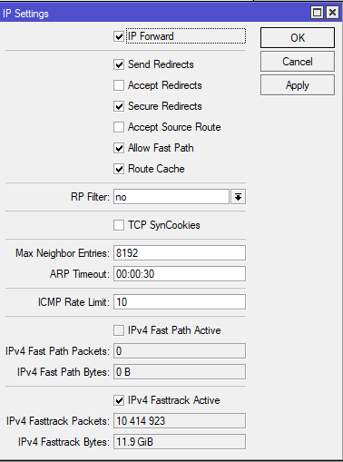

# RB760IGS-SAMPLE-CONFIG
Handling 1Gbps routing performance on RB760IGS Hex S

At first, as a mikrotik first-timer, I was getting < 400 Mbits/sec on Hex S with inter-VLAN routing using Hex S as router on a stick. The CPU was running at 100% on one core. Then, I searched through the internet and found out that I only need to enable `fasttrack`. 

However, this was confusing a bit as the [wiki](https://wiki.mikrotik.com/wiki/Manual:IP/Fasttrack) says that you need to have `fastpath` enabled on the setting and getting `fastpath` enabled means there is no firewall enabled on the router but I already did have the masquerade NAT.



Anyway, I went on and [enabled](https://github.com/krisachai/RB760IGS-SAMPLE-CONFIG/blob/837dae2167d95633ca310680d94330633dbeb7de/config.txt#L66-L69) the `fasttrack` and it seems to work without fastpath ? (I have no idea).

The result was amazing the throughput went up to 880 Mbits/sec which is more than enough for a small office. I'm getting 100MB/s+ copying from freenas to windows 10 via smb. 

The CPU utilization was 80% on one core and 50% on another which was a good result as I will need some left for Wireguard and CAPsMAN.


# Performance Test (1500 MTU)
```
iperf -c 10.1.10.11 -P 4
------------------------------------------------------------
Client connecting to 10.1.10.11, TCP port 5001
TCP window size:  221 KByte (default)
------------------------------------------------------------
[  3] local 10.1.100.5 port 39042 connected with 10.1.10.11 port 5001
[  4] local 10.1.100.5 port 39044 connected with 10.1.10.11 port 5001
[  5] local 10.1.100.5 port 39046 connected with 10.1.10.11 port 5001
[  6] local 10.1.100.5 port 39048 connected with 10.1.10.11 port 5001
[ ID] Interval       Transfer     Bandwidth
[  3]  0.0-10.0 sec   321 MBytes   269 Mbits/sec
[  5]  0.0-10.0 sec   220 MBytes   184 Mbits/sec
[  4]  0.0-10.0 sec   336 MBytes   280 Mbits/sec
[  6]  0.0-10.1 sec   182 MBytes   151 Mbits/sec
[SUM]  0.0-10.1 sec  1.03 GBytes   883 Mbits/sec
```
